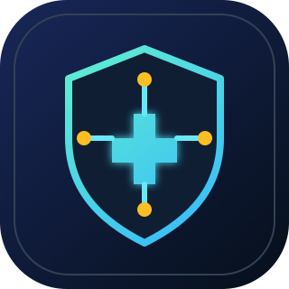
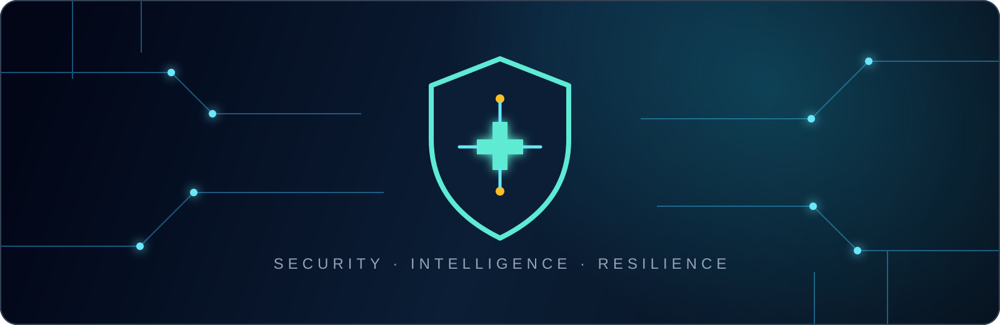

<!--
  GitHub Profile README
  Published GitHub profile for @serjoose.
-->

  

<h1 align="center">Hi, I'm serjoose 👋</h1>

  <strong>Cybersecurity Analyst · SOC & Network Security · Red / Blue Team</strong>

  

  I build practical security knowledge across detection, investigation, networking, and ethical security testing.

---

## About me

I am a cybersecurity-focused learner and builder with hands-on interest in both defensive and offensive security. My work spans SOC analysis, networking, OSINT and CSINT research, web development, and authorized security testing.

- 🔎 Investigating alerts, networks, and open-source intelligence
- 🛡️ Strengthening defensive security through a blue-team mindset
- 🎯 Developing offensive-security skills in authorized lab environments
- 🧩 Building web projects and security tooling with Python, JavaScript, and PowerShell

## Core capabilities

| Detection & intelligence | Security testing | Engineering & networks |
| --- | --- | --- |
| SOC analysis | Network pentesting | Python |
| Blue-team fundamentals | Web pentesting | JavaScript |
| OSINT & CSINT | Hardware pentesting | PowerShell |
| Network monitoring | Social engineering awareness | Web programming |
| Incident investigation | Red-team fundamentals | Advanced networking & security |

## Technology focus

  
  
  

  
  
  
  

## Certifications

  
  

> Certificate verification links are available on request.

## What I'm working on

- Security tooling and practical automation
- Network and web-security labs in authorized environments
- SOC investigation workflows and threat-intelligence research
- Clean, security-focused web projects

## Connect

Open to collaboration on responsible security tooling, practical labs, and security-focused web projects.

  Security is strongest when curiosity is paired with responsibility.

